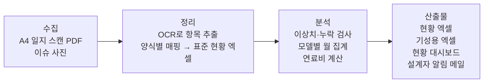

# 내구시험 일지 데이터 정리·기성 자동화 — 프로젝트 기획서

| 항목 | 내용 |
|---|---|
| 리포 | data09-03 |
| 제출자 | 전병수 |
| 직무·소속 | 산업차량제품개발팀. 내구시험 운영 담당(6개월 전 담당 업무), 현재 양산PM |
| 과정 | 현장 데이터 디지털화 전문가과정 1차수 |
| 작성일 | 2026-09-28 |
| 문서 상태 | 초안 v0.1 — 수강생 제출 자료 기반 |

## 1. 추진 배경과 현안

- 개발 모델의 내구시험을 **1명이 관리·운영**하고 있습니다.
- 운전자들이 매일 A4 출력물 일지에 시험 내용과 문제점을 적습니다. 일지 양식은 **모델과 시험 종류에 따라 조금씩 다릅니다.**
- 담당자가 이 일지를 모델별 엑셀 파일에 다시 입력(시간, 배터리소모율, 충전량 등)하고, 문제점과 운전자가 보낸 이슈 사진도 정리합니다. 이 입력·정리 작업에 MH(맨아워)가 많이 듭니다.
- 월말에는 같은 엑셀에서 모델별 운행시간·연료 소모량을 다시 모으고, 오피넷 등에서 평균 연료 가격을 찾아 연료비를 계산해 기성 보고서를 만듭니다.
- 설계자들은 시험 현황을 한눈에 볼 수단이 없어, 담당자가 메일로 개별 전달하고 있습니다.

**현재 업무 흐름 (제출 원문 기준 8단계)**

1. 일일시험일지 접수 — A4 일지(시험 내용·문제점) 입수
2. 일일시험일지 입력 — 모델별 엑셀 입력(시간, 배터리소모율, 충전량 등), 문제점 입력, 이슈 사진 정리
3. 데이터 분석 — 이상 유무·문제 심각성 확인, 사진 첨부해 설계 담당자에게 메일로 원인분석 요청
4. 실차 점검 — 필요 시 실차 확인
5. 운행시간 모델별 정리 — 월말 기성처리용, 모델별 월 운행시간 집계
6. 연료 소모량 모델별 정리 — 경유·LPG 가스 모델별 소모량 집계, 오피넷 등 평균 연료 가격으로 연료비 계산
7. 월간 기성자료 메인 보고서 작성 — 운행시간·연료 소모량 등으로 기성비 보고서 작성
8. 결재 후 서무에게 전달해 전표처리(기성처리)

이 기획은 2·5·6·7단계(입력과 집계)를 자동화하고, 3단계를 대시보드로 돕는 것을 대상으로 합니다. 1·4·8단계는 사람의 확인·결재가 필요한 단계로 그대로 둡니다.

## 2. 목표

**최종 목표**

A4 일지(PDF)를 읽어 현황 엑셀에 자동 입력하고, 월말 기성처리용 엑셀과 현황 대시보드까지 한 흐름으로 만들어 내구시험 운영 MH를 줄이고 설계자가 현황을 스스로 파악하게 합니다.

**1차 개발 목표**

일지 양식 샘플이 아직 없으므로, 1차는 **OCR 뒤쪽**부터 만듭니다.
「현황 엑셀(표준 입력 형식)」을 정하고, 그 엑셀을 넣으면 ① 모델별 월 운행시간·연료 소모량·연료비를 계산한 기성용 엑셀과 ② 현황 대시보드가 나오는 브라우저 도구를 만듭니다.
이 부분은 지금 담당자가 손으로 하는 5·6·7단계를 바로 대체하고, 나중에 붙일 PDF 자동 인식(2단계)의 출력 형식이 됩니다.

## 3. 보유 데이터

| 데이터 | 형태 | 규모·주기 | 비고(민감도 등) |
|---|---|---|---|
| 모델별 일일 내구시험 일지 | A4 출력물에 운전자가 기록 → PDF | 매일, 모델별 | 모델·시험 종류별로 양식이 조금씩 다름. 수기 여부 미확인. 개발 모델 정보라 사내 기밀(가정) |
| 일지 기록 항목 | 일지 내 항목 | 매일 | 원문에 적힌 항목: 시간, 배터리소모율, 충전량, 문제점 (「등등」으로 더 있음) |
| 모델별 시험일지 정리 엑셀 | Excel | 매일 누적 | 담당자가 수기 입력. 시트·열 구성 미제출 |
| 이슈 사진 | 이미지(운전자 전달) | 수시 | 전달 경로(메신저·메일 등) 미기재 |
| 평균 연료 가격 | 오피넷 등 웹 조회 | 월 1회(기성 시점) | 경유, LPG 가스 |
| 월간 기성 보고서·기성처리 양식 | Excel(가정) | 월 1회 | 「일정 양식의 EXCEL 파일」. 양식 미제출 |

- 첨부파일은 없습니다. 일지 샘플·현재 엑셀 파일·기성 양식이 모두 필요합니다(10장).

## 4. 해결 방안 개요

- **수집**: 매일 받은 일지를 스캔(PDF)해 한 폴더에 모읍니다.
- **정리**: 양식이 모델·시험 종류마다 다르므로, 양식별 「어느 칸이 어떤 항목인지」 매핑표를 두고 OCR 결과를 표준 현황 엑셀 한 형식으로 맞춥니다. 사람이 확인·수정하는 화면을 거쳐 확정합니다.
- **분석**: 누락·범위 밖 값(예: 배터리소모율 이상치, 기준은 10장 확인)을 표시하고, 모델별 월 운행시간·연료 소모량을 합산해 연료비를 계산합니다.
- **산출물**: 현황 엑셀, 기성용 엑셀, 대시보드. 문제점이 입력된 날은 설계 담당자용 메일 초안(사진 첨부)을 만듭니다.

## 5. 주요 기능

| 기능 | 설명 | 우선순위 |
|---|---|---|
| 표준 현황 엑셀 형식 | 일자·모델·시험 종류·운전자·운행시간·배터리소모율·충전량·연료 종류·연료 소모량·문제점·사진 참조 등 한 행 = 한 일지(열 구성은 샘플 확인 후 확정, 가정) | MVP |
| 현황 엑셀 불러오기 | 기존 모델별 엑셀(여러 시트·파일)을 표준 형식으로 합치기 | MVP |
| 월간 기성 집계 | 모델별 월 운행시간, 연료 종류(경유·LPG)별 소모량 합계 | MVP |
| 연료비 계산 | 평균 연료 가격(월별, 사용자 입력)×소모량. 가격 출처·조회일 기록 칸 | MVP |
| 기성용 엑셀 출력 | 현재 쓰는 기성 양식과 같은 배치로 출력 | MVP(양식 수령 후) |
| 현황 대시보드 | 모델별 누적 운행시간, 최근 문제점 목록, 일지 입력 누락일 표시, 기간·모델 필터 | MVP |
| 입력값 검사 | 빈 칸, 전날보다 누적값이 줄어드는 경우, 범위 밖 값 표시 | MVP |
| PDF 일지 자동 인식 | 스캔 PDF에서 양식별 칸 위치로 값 추출(OCR), 확인·수정 화면 후 현황 엑셀에 추가 | 확장(2단계) |
| 양식 매핑 관리 | 모델·시험 종류별 양식 등록, 칸 ↔ 항목 연결표 | 확장(2단계) |
| 문제점 심각도 분류 | 문제점 문장을 AI가 분류(예: 안전·기능·경미, 기준은 10장 확인), 설계자 전달 메일 초안 생성 | 확장 |
| 사진 연결 | 이슈 사진을 일자·모델에 연결해 대시보드·메일에서 함께 보기 | 확장 |
| 알림 자동화 | 문제점 입력 시 Make로 설계 담당자 메일 자동 발송, Google Sheets 기록 | 확장 |
| 연료 가격 자동 조회 | 오피넷 평균 가격 자동 수집(공식 제공 방식 확인 필요) | 확장 |

## 6. 기대 산출물

- **현황 EXCEL**: PDF 일지에서 읽은 데이터가 입력된 표준 형식 엑셀(모델별 누적).
- **기성처리용 EXCEL**: 월별·모델별 운행시간, 연료 소모량, 연료비를 정해진 양식에 채운 파일.
- **현황 대시보드**: 설계자가 모델별 시험 진행과 문제점을 스스로 확인하는 화면.
- (확장) 설계 담당자 전달용 문제점 메일 초안, 월간 기성 보고서 초안.

## 7. 기술 구성

| 과정 도구 | 이 과제에서의 쓰임 |
|---|---|
| DAY3 멀티모달(OCR) | A4 일지 PDF에서 항목 값 추출. 수기라면 손글씨 인식 정확도 확인이 핵심 |
| DAY2 코랩/Python | 기존 엑셀 병합·월간 집계·연료비 계산 로직 검증 |
| DAY5 Make | 문제점 발생 시 설계 담당자 메일 발송, Google Sheets 누적 기록 |
| 생성형 AI | 문제점 문장 분류·요약, 메일·보고서 초안 |
| DAY4 Dify/NotebookLM | (선택) 누적 문제점 이력에 대한 질의응답 |

**개발 형태 (우리가 만드는 것)**

- **설치 없이 브라우저에서 도는 정적 웹 도구**. 엑셀을 끌어다 놓으면 브라우저 안에서만 계산하고 결과 엑셀을 내려받습니다. 파일이 외부 서버로 나가지 않아 개발 모델 자료를 다루기에 적합합니다(가정: 사내 보안 정책상 외부 업로드가 제한될 경우).
- 대시보드도 같은 웹 도구 안에서 현황 엑셀을 읽어 그립니다. 설계자는 공유 폴더의 최신 현황 엑셀을 열기만 하면 됩니다(공유 방식은 10장 확인).
- PDF 인식(2단계)은 두 갈래 중 선택합니다.
  - 인쇄 양식이 고정되고 값이 활자라면: 칸 위치 기반 추출(브라우저 또는 Python).
  - 수기라면: 생성형 AI 비전(이미지 인식) 모델로 칸별 값 추출 → 사람 확인. 외부 AI 사용 가능 여부는 사내 정책 확인 필요.

## 8. 개발 단계

**1단계 — 지금 바로 개발 가능한 부분**

샘플 없이도 원문의 업무 흐름(5·6·7단계)과 항목만으로 만들 수 있습니다. 표준 열 이름은 샘플을 받으면 맞춰 바꾸도록 설정으로 분리합니다.

- 표준 현황 엑셀 템플릿(빈 양식 + 예시용 가짜 데이터, 가짜임을 명시).
- 현황 엑셀 → 모델별 월 운행시간·연료 종류별 소모량 집계 → 월 평균 연료 가격 입력 → 연료비 계산 → 기성용 엑셀 내려받기.
- 현황 대시보드(모델별 누적 운행시간, 월별 추이, 문제점 목록, 입력 누락일).
- 입력값 검사(빈 칸, 누적값 역행).

**2단계**

- 일지 PDF 샘플(모델·시험 종류별 양식 각 1부 이상)을 받아 양식별 매핑표를 만들고 OCR 추출 → 확인 화면 → 현황 엑셀 추가.
- 실제 기성 양식에 맞춘 출력 배치.
- 기존 모델별 엑셀 이력 일괄 이관.

**3단계**

- 문제점 AI 분류와 설계 담당자 메일 초안(사진 첨부), Make 자동 발송.
- 사진-일지 연결, 오피넷 가격 조회 자동화(허용되는 방식일 때).
- 월간 기성 보고서 초안 자동 작성.

## 9. 기대 효과

- 1명이 매일 하던 일지 재입력과 월말 재집계가 줄어 내구시험 운영 MH가 감소합니다.
- 입력 형식이 하나로 통일되어 모델·시험 종류가 바뀌어도 집계 방식이 흔들리지 않습니다.
- 설계자가 대시보드에서 현황과 문제점을 직접 확인해, 담당자를 거치는 개별 문의·메일이 줄어듭니다.
- 연료 가격 출처·조회일이 함께 남아 기성 근거 추적이 쉬워집니다.
- 담당자가 바뀌어도(제출자도 현재 양산PM으로 이동) 같은 절차로 운영할 수 있어 업무 인수인계가 쉬워집니다.

## 10. 확인 필요 사항

**담당·범위**

- 제출자는 현재 양산PM입니다. 지금 내구시험을 운영하는 담당자가 이 도구의 실사용자가 되는지, 샘플 자료를 그 담당자에게서 받을 수 있는지.
- 동시에 시험 중인 모델 수와 시험 종류 수(양식이 몇 종인지).

**필요한 샘플 자료**

- 모델·시험 종류별 A4 일지 PDF 각 1부 이상(개인정보·기밀 부분은 가려도 됨).
- 일지가 **수기인지 활자 입력인지**, 스캔 해상도.
- 현재 쓰는 모델별 정리 엑셀 1개(시트 구조·열 이름 확인용).
- 기성처리용 「일정 양식의 EXCEL 파일」과 월간 기성 보고서 양식.

**계산 규칙**

- 기성비 산정 방식: 운행시간에 곱하는 단가가 있는지, 연료비 외 항목이 있는지.
- 연료 소모량 단위(L, kg 등)와 LPG 가격 기준(리터·kg), 「평균 연료 가격」의 기간·지역 기준.
- 전동 모델(배터리소모율·충전량)의 전력비도 기성 대상인지.
- 이상 유무 판단 기준(항목별 정상 범위)과 문제 심각도 구분 기준.

**운영 환경**

- 대시보드를 설계자와 어떻게 공유할지(사내 공유 폴더, 사내망 웹, Google Sheets 등). 외부 클라우드·외부 AI 사용 가능 여부.
- 이슈 사진이 들어오는 경로와 보관 위치.

## 부록. 제출 원문 요약

| 구분 | 내용 |
|---|---|
| 게시물 1 (2026-09-09 06:06) | 「내구시험 데이터 정리」. 직무·소속, 현안(1인 운영 MH·대시보드), 보유 데이터(A4 일지 PDF), 기대 산출물(현황 EXCEL·기성 EXCEL·대시보드), 업무 flow 8단계 |
| 첨부파일 | 없음 (attachments.json 비어 있음) |
| 원문 파일 | `data09-03/기획_원문.md` |
