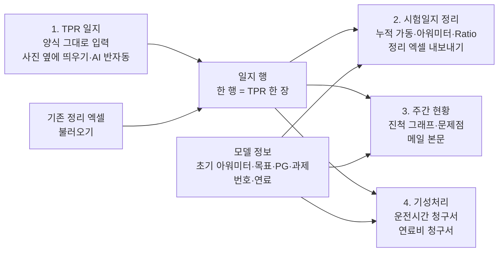

# 내구시험 일지 데이터 정리·기성 자동화 — 프로젝트 기획서

| 항목 | 내용 |
|---|---|
| 리포 | data09-03 |
| 제출자 | 전병수 |
| 직무·소속 | 산업차량제품개발팀. 내구시험 운영 담당(6개월 전 담당 업무), 현재 양산PM |
| 과정 | 현장 데이터 디지털화 전문가과정 1차수 |
| 작성일 | 2026-09-28 (v0.1) · 2026-09-29 오전 (v0.2) · 2026-09-29 오후 (v0.3) · 2026-09-29 오후 늦게 (v0.4) · 2026-09-30 (v0.5) · 2026-09-30 오전 늦게 (v0.6) · 2026-09-30 오후 (v0.7) · 2026-09-30 저녁 (v0.8) |
| 문서 상태 | v0.8 — 실제 양식 4종 기준(v0.2) + 확인 답변으로 계산 규칙 확정(v0.3) + 기성 마감·휴일·외부 AI 규칙 확정(v0.4) + 기성 기간 직접 입력·연료 정산 방식(결제 금액/월평균)·회사 휴무일·날짜↔요일 대조(v0.5) + 시험일지 정리 모델 목록 기간 보기·사용 종료(v0.6) + 처음 화면·다크블루 디자인(v0.7) + 처음 화면 그림 움직임·구간 누르기(v0.8) |

> **v0.2 에서 바뀐 것**: v0.1 은 양식 샘플 없이 「표준 현황 엑셀」을 가정해 썼습니다.
> 2026-09-29 수강생이 실제 양식 4종(TPR 일지, 시험일지 정리 엑셀, 기성 청구서 2종)과 주간 현황 메일 요구를 보내 와,
> 업무 흐름·데이터 구조·기능·개발 단계를 그 양식 기준으로 다시 썼습니다. 요청 원문과 반영 방식은 11장에 있습니다.
>
> **v0.3 에서 바뀐 것**: 같은 날 오후 수강생이 확인 질문에 답해(11.2), 특화 시험 정의·목표 가동시간(1000h, 특화 +500h)·과급 고정값·요소수 청구·주간 보고 요일(수요일)·문제점 즉시 알림을 확정·반영했습니다.
>
> **v0.4 에서 바뀐 것**: 오후 늦게 온 답(11.3)으로 기성 마감일(근무일 기준 월 말일)·마감일 가입력 → 가동 후 확정 흐름, 휴일 판정(날짜 기준, 토요일 주간만 30%), 외부 AI 에 TPR 올리기(하루 1~2장까지)를 확정하고, 「마감 준비」 체크리스트와 가입력·확정 대조를 더했습니다.
>
> **v0.5 에서 바뀐 것**: 2026-09-29 오후 ~ 09-30 아침 답(11.4)으로 기성 기간을 사용자가 정하고(운전시간은 월 단위, 연료비는 영수증 기준 — 탭마다 따로), 가입력·확정 차이의 다음 달 조정은 하지 않기로 했습니다. 연료비는 **경유·요소수 = 주입 때 카드 결제 금액, LPG = 사용량 × 오피넷 월평균(달별)** 로 바꾸고, 받은 새 양식(청구서·기종별 연료 주입 현황)의 배치를 따랐습니다. 회사 휴무일(휴가·근로자의 날) 목록, 손글씨 날짜를 요일로 대조하는 기능, 「지게차 충전(점심)」 오자 수정, 문제점 메일은 자동으로 띄우지 않고 정리만 하도록 바꿨습니다.

> **v0.6 에서 바뀐 것**: 2026-09-30 오전 수강생 요청(11.5) — 모델이 계속 쌓이는 「시험일지 정리」 화면을 **기간으로 나눠 보기**(이번 달·이번 기성 기간·직접 입력·전체)와 시험이 끝난 모델의 **「사용 종료」 표시**를 더했습니다.

> **v0.7 에서 바뀐 것**: 2026-09-30 오후 「프로젝트 개발 완료 - 디자인 적용전입니다.」 글의 수강생 댓글(11.6)로 **처음 화면**(지게차 내구시험장 코스 그림 + 업무 흐름 4단계)과 **다크블루 색 체계**를 입혔습니다. 기능·메뉴·데이터 흐름은 바뀌지 않았습니다.

> **v0.8 에서 바뀐 것**: 같은 날 저녁 강사 요청(11.7)으로 처음 화면 그림에 **움직임과 이벤트**를 더했습니다 — 지게차가 시험 구간을 달리고(바퀴·차체 출렁임·마스트 흔들림·먼지·배기), 코스 배치도의 점이 같이 돌며, 지게차에 마우스를 올리면 전조등·지금 구간 이름, 구간을 누르면 그 구간에서 일지에 적는 칸을 보여 줍니다. 기능·메뉴·데이터는 그대로입니다.

## 1. 추진 배경과 현안

- 개발 모델(지게차 등 산업차량)의 내구시험을 **1명이 관리·운영**합니다. 동시에 여러 모델·호기가 주간·야간·휴일로 돌아갑니다.
- 운전자는 매 교대마다 A4 「**내구시험일지 및 문제점 보고서(TPR, Test Problem Report)**」에 손으로 적습니다.
- 담당자가 TPR 을 보고 모델별 「**시험일지 정리**」 엑셀에 한 줄씩 다시 입력하고, 누적 가동시간·누적 아워미터·연료 주입량을 계산합니다.
- 매주 모델별 진행 시간(현 시험시간 / 목표시간)과 문제점을 정리해 **설계담당자에게 메일**로 보냅니다.
- 매월 시험 운영 업체의 **운전시간 기성 청구서**와 **연료 주입 청구서**를 정리 엑셀에서 다시 집계해 만듭니다.
- 이 네 단계가 모두 사람 손으로 옮겨 적고 다시 더하는 일이라 MH 가 많이 들고, 옮겨 적다 틀린 값이 청구서까지 이어집니다.

**현재 업무 흐름 (2026-09-29 수강생이 보낸 4단계)**

| 단계 | 하는 일 | 양식 | 이 도구가 하는 일 |
|---|---|---|---|
| 1. 시험일지 | 운전자가 교대마다 TPR 작성 | 「내구시험일지 및 문제점 보고서(TPR)」 A4 종이 → PDF | 양식과 같은 순서의 입력 화면. 사진을 옆에 띄우고 옮겨 적기, AI 반자동 읽기 |
| 2. 시험일지 정리 | TPR 을 모델별 엑셀에 옮기고 누적 계산 | 모델별 정리 엑셀(위 4줄 모델 정보 + 일자별 행) | 1번 일지로 **자동 누적 계산**한 정리표 화면과 같은 배치의 엑셀 내보내기 |
| 3. 현황 전달 | 모델별 진행 시간 그래프 + 문제점 정리, 매주 설계담당자에게 메일 | (정해진 양식 없음) | 주간 현황 화면 — 진척 막대 그래프, 모델별 문제점, 메일 제목·본문 생성, 그림 저장·인쇄 |
| 4. 기성처리 | 운전시간 정산·연료비 정산 청구서 작성 → 결재 → 서무 전표 | 「개발장비 내구시험 기성 청구서」·「연료 주입 청구서」 엑셀 | 기간·모델별 자동 집계, 받은 청구서 배치 그대로 엑셀 출력 |

결재·전표처리(사람의 확인이 필요한 일)와 실차 점검은 그대로 둡니다.

## 2. 목표

**최종 목표**

운전자 TPR 한 장을 한 번만 입력하면 정리표·주간 현황 메일·월간 기성 청구서 두 종이 모두 자동으로 나오게 해, 옮겨 적기와 다시 더하기를 없앱니다.

**이번 개발 목표 (v0.2)**

- TPR 양식 그대로 입력하는 화면(사진·PDF 를 옆에 띄워 두고 옮겨 적기, 반자동 AI 읽기).
- 일지로부터 모델별 정리표 자동 계산(누적 가동시간·누적 아워미터·누적 Ratio·경유/요소수 합계)과 엑셀 내보내기.
- 주간 현황(진척 그래프·문제점·메일 본문).
- 운전시간·연료비 기성 청구서 자동 집계와 엑셀 출력.
- 지금 쓰는 정리 엑셀을 불러와 이력을 그대로 이어 쓰기.

## 3. 보유 데이터 — 실제 양식 구조

사진의 칸 이름을 그대로 옮겼습니다. 실명·서명이 있는 사진 원본은 저장소에 넣지 않았습니다.

### 3.1 TPR 일지 (운전자 작성, A4)

| 구역 | 칸 |
|---|---|
| 머리 | 작성자 · 작성일 · 요일 · 주/야(동그라미) · 날씨 · 결재(작성/검토) |
| 기본 정보 | 모델명(호기, 예: MODEL-X #4) · 금일충전시간 · 금일가동시간 · Hour Meter(전일/금일) |
| 시험 항목별 시간 | 기본/요철 사이클(h) · 기본 사이클(회) · 요철 사이클(회) · 배터리 충전 점검(h) · 장비 점검/TPR 작성(h) · 에어컨 가동(h) · 히터 가동(h) · 휠너트 풀림 확인 |
| 배터리 상태표기(시작 및 종료) | 기본/요철(2hr) · 기본/요철(1hr 50분) · 지게차 충전(정심) · 기본/요철(2hr) · 기본/요철(1hr 50분) · 기본/요철(50분) · 배터리 충전 점검 — 구간마다 시작 % / 종료 % |
| 금일 발생 문제점/조치내용 | No. · 내용 · 비고 (여러 줄) |
| 일일 주요 점검 항목 | ① 성능 이상 ② 유압/동력전달/마스트 누유·누기 ③ 회전부·배터리팩 이음/진동·체결부 풀림 ④ 작업장치 용접부 파손·마멸·유격 ⑤ 상부 의장품 파손/변형 — 각각 유/무 |
| 기타 | 협조·지원·미결 사항 · 개선/건의사항(편의성, 정비성 등) |

사진 1 의 값으로 확인한 관계: Hour Meter 금일 − 전일 = 금일가동시간 (945.5 − 938.5 = 7.0).

### 3.2 시험일지 정리 엑셀 (담당자 작성, 모델별)

- **위 4줄(모델 정보)**: 모델명/호기(예: MODEL-Y/#1) · 기준일 · 초기 아워미터(67.0hr) · 목표 가동시간(200hr) · PG 정보 · 누적 Ratio · 누적 가동시간 · 경유 합계 · 요소수 합계
- **6번째 줄부터 일자별 행**: Date · 주/야/휴 · 일 가동시간 · 기본/요철 사이클 · 누적 가동시간 · 누적 아워미터 · 기본 사이클 회수 · 요철 사이클 회수 · 장비 점검 및 TPR 작성 · 특회 장비 수리 · 히터가동시간 · 에어컨가동 시간 · 경유 주입량 · 요소수 주입량 · 날씨 · 운전자 Code · 문제점/조치내용
- 사진 2 의 값으로 확인한 계산: **누적 가동시간 = 일 가동시간의 누계**(7.5 → 15.0 → 18.5 …), **누적 아워미터 = 초기 아워미터 + 누적 가동시간**(67 + 7.5 = 74.5 …), 경유 합계 985L = 178 + 204 + 159 + 257 + 187.
- 가동 0 시간인 날(장비 입고 점검 등)도 행이 남고 누적은 그대로입니다.

### 3.3 운전시간 기성 청구서 (「개발장비 내구시험 기성 청구서」)

- 머리: 1. 업체 · 2. 기간(예: 05.06~05.30, 달력 월과 다름) · 3. 기성금액(VAT 별도) · 결재란(파트장·팀장·부문장)
- 4. 기성내역: 순 · 기종 · 주간/야간/휴일(기종마다 3줄) · M/H(h)[장비 실가동 누적 · 금월 · TPR 작성 및 점검 · 특화 시험 · 과급 · 소계] · 단가(원/h) · 기성금액(원) · 과제번호
- 사진 3 의 값으로 확인한 계산: **소계 = (금월 + TPR + 특화) × (1 + 과급)**, 과급 주간 0% · 야간 19% · 휴일 30%, **기성금액 = 소계 × 단가**(반올림 전 소계로 곱함: 34 × 1.19 = 40.46h × 24,400 = 987,224원). 계 1,020.5h · 24,901,176원이 줄 합계와 일치.
- 각주: 특화시험 = 장비 운행 중 배터리/충전 상태 점검, 차량 이상 발생 시 장비 점검/수정한 시간.
- **확정(수강생 답)**: 특화 시험은 일반 내구 외에 ① 배터리 충전 점검 ② 동력전달 특화 등으로 진행하는 시간이며, 운행 중 장비 수리는 따로 잡지 않고 특화 시험 시간에 포함합니다. 과급 야간 19%·휴일 30% 는 계약서에 명기된 고정값입니다. 누적 목표는 보통 1000시간, 특화해 더 하면 +500시간(1500시간)입니다.
- 5. 내구시험 현황: 월간 가동일수 · 가동 투입 인원 · 월간 가동 시간 · 완료 모델. 유첨: 기종별 청구서.
- 시트 탭: 청구서 + 기종별 시트.

### 3.4 연료 주입 청구서 (「개발장비 내구시험 연료 주입 청구서」)

- 머리: 1. 모델별 청구 금액 · 2. 기간 · 3. 주유 금액(VAT 포함) · 결재란
- 4. 주유 내역: 순 · 기종 · 유종 · 장비 가동(총누적 · 금월) · 가스/경유 사용량(kg·ℓ) · 단가(원/kg) · 금액(원) · 과제번호 · 비고(예: 35통)
- 사진 4 의 값으로 확인한 계산: **LPG 금액 = 사용량 × 단가**(930kg × 2,505원 = 2,329,650원), 비고 62통 = 930kg ÷ 15kg.
- **확정(수강생 답)**: LPG 는 15kg 규격 통. 모델에 따라 요소수가 들어가며 **요소수도 청구 대상**.
- **2026-09-30 받은 새 양식(경유·LPG 기종이 함께 있는 달, 사진 4장 — 저장소 미수록)**
  - 청구서: 기간 05.27 ~ 06.30(달력 월이 아님). LPG 기종은 525kg · 단가 2,484 · 1,304,100원 · 비고 35통, 경유 기종은 2,020ℓ · 단가 「-」 · 3,137,560원, 계 4,441,660원(VAT 포함).
  - 각주 3줄: 경유는 주 1회 카드 결제로 정산 · (특정 기종의 연료 사용 사유) · 가스는 1개월 사용량에 월 평균 가격(오피넷)으로 월 말 카드 결제.
  - 유첨: 1) 기종별 연료 주입 현황 2매 2) LPG / 경유 대장 각 1매 3) LPG 단가 결정 내역 1매. 시트 탭: 청구서 · (LPG 기종) · LPG대장 · 단가 · (경유 기종) · 경유대장.
  - 「기종별 연료 주입 현황」: 1. 모델 · 2. 기간(그 기종의 실제 첫날 ~ 끝날) · 3. 주유 금액 · 4. 기성내역 — 가동 일자 · 주/야/휴 · 장비 가동(총누적·금월) · 주유량(경유 ℓ·요소수 ℓ 또는 LPG kg) · 단가 · 금액. 경유는 **주유한 줄마다 결제 금액**이 있고 단가 칸은 비어 있음. LPG 는 교대마다 kg 만 있고 **단가는 소계 줄에만**(2,484). 아래에 소계(연료) · 소계(요소수) · 합계.
  - 도구는 이 배치를 그대로 따르고, 사진의 숫자(3,137,560 · 1,304,100 · 4,441,660 · 35통 · 금월 359.5h / 117.5h)를 가명 기종으로 테스트에서 재현합니다.
- **정산 방식(2026-09-30 확정)**: 경유·요소수 = 주입 때 카드 결제 금액 합(리터당 단가를 곱하지 않음), LPG = 기간 사용량 × 오피넷 월 평균(두 달에 걸치면 달별). LPG·경유 대장은 스캔해 첨부하므로 도구가 만들지 않습니다.

## 4. 해결 방안 개요

- 저장 단위는 **TPR 한 장 = 일지 한 행**입니다. 정리표·주간 현황·청구서는 모두 이 행들에서 그때그때 계산하므로 한 곳을 고치면 전부 따라 바뀝니다.
- 정리 엑셀 위 4줄(초기 아워미터·목표 가동시간·PG 정보)과 청구서의 과제번호·연료는 **모델 정보**로 따로 둡니다.
- 모든 계산은 브라우저 안에서 합니다. 파일이 서버로 나가지 않습니다.

## 5. 주요 기능

| 기능 | 설명 | 상태 |
|---|---|---|
| TPR 입력 화면 | 3.1 의 모든 칸을 양식 순서대로. 요일 자동, 주/야/휴, 전 일지 Hour Meter 불러오기, 금일 = 전일 + 가동 계산, 배터리 방전·충전 합계, 점검항목 ①~⑤ 유/무, 문제점 여러 줄. 「저장하고 다음 일지」(주간 → 같은 날 야간) | 완료 |
| 사진 옆에 띄우기 | 일지 사진·PDF 를 입력 칸 옆에 띄워 옮겨 적기(저장·전송하지 않음) | 완료 |
| AI 반자동 읽기 | 선택 기능. 「1장·오늘 2장 이내」 확인에 표시해야 요청문을 복사할 수 있고 하루 2장이 넘으면 막음(TPR 대외비). 기본은 사진 옆에 띄워 직접 옮겨 적기(외부 전송 없음) | 완료 (v0.4 제한 추가) |
| 모델 정보 | 모델·호기별 초기 아워미터·목표 가동시간·PG 정보·과제번호·연료 | 완료 |
| 시험일지 정리표 | 3.2 의 표를 자동 계산, 모델별·전체 엑셀(같은 배치) | 완료 |
| 모델 목록 기간 보기·사용 종료 | 정리 화면의 모델 목록을 이번 달·이번 기성 기간·직접 입력·전체로 나눠 보고, 기본은 그 기간에 일지가 있는 모델만. 모델마다 기간 일지 장수·가동시간·문제점, 누적/목표. 시험이 끝난 모델은 「사용 종료」로 두면 입력·필터 목록에서 빠짐(다시 보기·다시 사용 가능). 기간 정리 엑셀 | 완료 (v0.6) |
| 기존 정리 엑셀 불러오기 | 위 4줄에서 모델 정보를 읽고, 6번째 줄 열 이름을 자동 연결(경유 주입량 → 경유) | 완료 |
| 주간 현황 | 진척 막대(SVG), 진행 표·예상 완료일(참고), 모델별 문제점, 메일 제목·본문 생성·복사·메일 프로그램 열기, PNG/SVG 저장, 인쇄 | 완료 |
| 운전시간 기성 청구서 | 3.3 계산, 단가·과급 입력, 5. 현황 자동, 청구서(칸 합치기) + 기종별 상세 시트 엑셀 | 완료 |
| 연료비 청구서 | 3.4 계산 — 경유·요소수는 일지의 결제 금액, LPG 는 달별 오피넷 월평균 단가(출처·조회일). 기간을 운전시간과 따로 정함. 청구서 + 기종별 연료 주입 현황(받은 배치) + 단가 시트 엑셀 | 완료 (v0.5 정산 방식 변경) |
| 날짜 ↔ 요일 대조 | TPR 작성일 옆에 「일지에 적힌 요일」. 맞지 않으면 잘못 읽었을 법한 날(1/30 → 1/3 등) 가운데 요일이 맞는 날을 버튼으로. AI 요청문에도 요일 확인을 넣고, 현황 데이터 검사에 경고 | 완료 (v0.5) |
| 회사 휴무일 | 일반 달력(공휴일 목록)에 더하는 회사 휴무일 목록 — 근로자의 날 초안, 휴가는 「시작~끝 이름」 | 완료 (v0.5) |
| 입력값 검사 | 1단계 검사 + 주/야 같은 날 역행, 주/야/휴 판독, 점검항목 「유」인데 문제점 없음, 점검 시간 24h 초과, 휴일 근무(일요일·공휴일·휴일 야간·평일 「휴」) | 완료 |
| 기성 마감 준비 | 마감일 = 근무일 기준 월 말일(주말·공휴일 목록 제외) 자동 계산, 기성 기간 기본값 = 전달 마감일 다음 날 ~ 이달 마감일, 1일부터 매일 채워지는 청구서 초안, 「마감 준비」 체크리스트 8항목 | 완료 (v0.4) |
| 마감일 가입력 → 확정 | TPR 입력에 「마감 전 가입력(예상치)」 표시 → 가동 후 「확정 저장」. 예상치를 남겨 기성처리 화면·청구서 엑셀 「가입력·확정 대조」 시트에 항목별 차이와 기성금액·주유 금액 차이 | 완료 (v0.4) |
| 공휴일 목록 | 사용자가 고치는 목록(양력 공휴일 자동 + 2026년 음력·대체·선거일 초안). 마감일·휴일 판정에 씀 | 완료 (v0.4) |
| 문제점 메일 정리 | 문제점이 적힌 일지를 저장하면 안내 띠만 띄우고, 누르면 문제점·사진 목록 메일 초안(받는 사람은 그때그때 적음). 자동으로 띄우거나 보내지 않음 | 완료 (v0.5 — 자동 알림에서 바꿈) |
| 현황 대시보드 | 1단계 대시보드(누적·월별 추이·문제점·누락일) 유지 | 완료(1단계) |
| 메일 자동 발송 | 매주 정해진 시각에 자동 발송 | 다음 단계(사내 메일·Make 가능 여부 확인) |
| 손글씨 자동 인식(OCR) | 사진에서 칸 위치로 자동 추출 | 다음 단계 — 지금은 AI 반자동 |
| 팀 공유 | 담당자·설계자·기성 담당이 같은 자료 보기 | 다음 단계 — `supabase/schema.sql` 준비됨 |

## 6. 기대 산출물

- TPR 일지 입력 화면과 일지 행(브라우저 저장, 엑셀·CSV 내보내기).
- 모델별 **시험일지 정리 엑셀**(받은 정리 엑셀 배치).
- **주간 현황 메일** 제목·본문과 진척 그래프 그림(PNG/SVG).
- **운전시간 기성 청구서**·**연료 주입 청구서** 엑셀(받은 청구서 배치, 기종별 시트 포함).

## 7. 기술 구성

| 과정 도구 | 이 과제에서의 쓰임 |
|---|---|
| DAY3 멀티모달 | TPR 사진 → JSON(반자동). 손글씨라 사람 대조가 필수 |
| 생성형 AI | 요청문·JSON 형식을 도구가 만들어 줌 |
| DAY5 Make | (다음 단계) 주간 메일 자동 발송 |
| DAY2 코랩/Python | 계산 규칙 검증(도구는 JavaScript 로 같은 계산, `node test/logic.test.mjs`) |

- **설치 없는 정적 웹 도구**: `index.html` 을 더블클릭해도 열립니다(인터넷 없어도 동작, 엑셀 라이브러리 내장).
- 계산 로직은 `js/logic.js` 한 파일, 사진의 실제 숫자(987,224원·24,901,176원·2,329,650원·누적 199.5h·아워미터 266.5h 등)로 테스트합니다.
- 팀 공유가 필요해지면 `supabase/schema.sql`(RLS 포함)로 옮깁니다.

## 8. 개발 단계

**1단계 (2026-09-28, 완료)** — 샘플 없이 가정한 표준 현황 엑셀 → 월간 연료비 집계·대시보드·입력값 검사.

**2단계 (2026-09-29, 이번)** — 실제 양식 4종 반영.
- TPR 입력 화면, 사진 옆 띄우기, AI 반자동 읽기
- 모델 정보, 시험일지 정리표 자동 계산·엑셀
- 주간 현황(그래프·문제점·메일)
- 운전시간·연료비 기성 청구서 엑셀
- 기존 정리 엑셀 불러오기(위 4줄 모델 정보 포함), DB 스크립트에 새 칸·표 추가
- (v0.4 보강) 기성 마감일 자동 계산·마감 준비 체크리스트·마감일 가입력 → 확정 대조, 휴일 날짜 판정, 외부 AI 1~2장 제한
- (v0.6 보강) 시험일지 정리 모델 목록 기간 보기(이번 달·이번 기성 기간·직접·전체)·사용 종료 표시
- (v0.5 보강) 기성 기간 직접 입력(운전시간·연료비 따로), 연료 정산 방식(결제 금액 / LPG 달별 월평균), 기종별 연료 주입 현황 배치, 회사 휴무일, 날짜 ↔ 요일 대조

**3단계**
- 실제 정리 엑셀·TPR 여러 장으로 검증(아래 10장 확인 뒤)
- 주간 메일 자동 발송(사내 메일 또는 Make), 팀 공유(DB 연결)
- 손글씨 자동 인식 정확도 확인 후 반자동 → 자동 전환 여부 결정

## 9. 기대 효과

- TPR 을 한 번만 입력하면 정리표·주간 메일·청구서 두 종이 모두 나와, 옮겨 적기와 재집계가 사라집니다.
- 누적 가동시간·아워미터·기성금액을 사람이 더하지 않아 청구서 계산 실수가 없어집니다(사진 속 청구서와 같은 값이 나오는 것을 테스트로 확인).
- 설계담당자는 매주 같은 형식의 그래프·문제점 메일을 받습니다.
- 담당자가 바뀌어도 같은 절차로 운영할 수 있습니다.

## 10. 확인 필요 사항

**확정됨 (2026-09-29 오후 수강생 답 — 11.2)**: 특화 시험 정의, 목표 가동시간 1000h/1500h, 과급 19%·30% 고정, LPG 15kg 통, 요소수 청구, 정리 엑셀 날짜 칸(엑셀 날짜 값), 배터리 온도(일지에 적지 않음), 주간 보고(매주 수요일 R&D 전체 + 일지 PDF), 문제점 즉시 알림.

**확정됨 (2026-09-29 오후 늦게 — 11.3)**: 기성 마감일 = 근무일 기준 월 말일, 마감일은 기성 값만 가입력 후 가동 뒤 확정, 휴일은 날짜로 구분(TPR 에 따로 적지 않음), 휴일 근무는 계약상 토요일 주간뿐·30%(주/야 구분 없음 — 야간이 없음), 외부 AI 에 TPR 은 1~2장까지(여러 장은 대외비).

**확정됨 (2026-09-30 — 11.4)**: 기성 기간은 사용자가 입력(운전시간 월 단위, 연료비 영수증 기준), 가입력·확정 차이의 다음 달 조정 없음, 회사 휴무일 = 휴가·근로자의 날, LPG 입고 대장은 스캔 첨부(도구 대상 아님), 경유·요소수 = 주입 때 카드 결제 금액, LPG = 사용량만 적고 오피넷 월평균 × 사용량, 주간 회신은 R&D 전체만, 문제점 메일은 협의 후 직접(자동 발송 없음).

**아직 남은 확인**
- 요소수 소계 — 받은 양식에 요소수 50ℓ 인데 금액 0 원으로 적혀 있습니다. 그 달 요소수를 따로 결제(다른 카드·재고분)해서 청구하지 않은 것인지 확인이 필요합니다. 도구는 요소수 결제 금액을 적은 만큼 청구하고, 비우면 「빈 칸」으로 알립니다.
- LPG 기간이 두 달에 걸칠 때 달별 월평균을 각각 곱하는지(도구의 방식), 한 달 값으로 몰아서 곱하는지.
- 2027년 이후 음력 명절·대체공휴일 — 공휴일 목록에 직접 더해야 합니다(회사 휴가 날짜도 해마다 적어야 함).
- 청구서 「장비 실가동 누적」 칸 — 도구는 기간 끝까지의 누적 가동시간(목표 도달 시 1000·1500 이 됨)으로 계산. 사진의 3번 기종(1000.0) 처럼 완료 모델 목록에 없는 기종의 값이 맞게 나오는지 실제 자료로 대조 필요.
- 주간 메일 받는 사람(R&D 전체 메일 그룹 주소) — 화면에 적으면 기억합니다.
- 전동 모델 정리 엑셀(배터리 충전량 칸 위치). 배터리 온도는 클러스터 데이터로거로 무선 수신해 확인만 하고 일지에는 적지 않는다는 답이라 칸을 두지 않았습니다(데이터로거 파일 연계는 다음 단계 후보).
- 설계자와 공유하는 방법(메일 첨부로 충분한지, 사내망 공유가 필요한지).

## 11. 2026-09-29 수강생 추가 요청

### 11.1 오전 — 실제 양식 4종

원문: `docs/source/2026-09-29_패들릿_추가요청.md`

| 요청 원문 | 반영 방식 | 남은 확인 |
|---|---|---|
| 「1.시험일지(운전자 작성 샘플) — 내구시험 운전 후 운전자 작성한 샘플 (PDF 파일)」 | 「1. 시험일지 입력」 화면을 TPR 양식 칸·순서 그대로 만듦. 사진·PDF 를 옆에 띄워 옮겨 적기, AI 반자동 읽기(요청문 → JSON 붙여 넣기). 저장 시 입력값 검사 결과를 바로 알림 | 휴일 표시 방법, 외부 AI 사용 가능 여부 |
| 「2.시험일지 정리 파일 샘플 — 시험일지 PDF 파일을 보고 모델별로 EXCEL에 측정한 값, 연료소모량, 배터리온도, 운행 시 문제점 등을 정리」 | 「2. 시험일지 정리」 — 일지에서 누적 가동시간·누적 아워미터·Ratio·경유/요소수 합계를 자동 계산, 정리 엑셀과 같은 배치로 내보내기. 기존 정리 엑셀 불러오기(위 4줄 모델 정보 읽기) | 날짜 칸 형식, 배터리온도 칸 위치 |
| 「3.내구시험 현황 전달 — 1)모델별 내구시험 진행 시간(현 시험시간/목표시간)을 그래프로 표시 2)모델별 문제점 현황을 정리하여 매주 설계담당자들에게 메일로 송부」 | 「3. 주간 현황」 — 진척 막대 그래프(목표선·완료 색), 진행 표, 모델별 문제점, 메일 제목·본문 생성, 복사·메일 프로그램 열기, 그래프 PNG/SVG 저장·인쇄 | **자동 발송은 대안 처리**: 브라우저만으로는 정해진 시각에 메일을 보낼 수 없고 사내 메일 계정을 공개 저장소 코드에 넣을 수 없어, 본문을 만들어 주고 발송은 사람이 합니다. 사내 메일·Make 사용 가능하면 3단계에서 자동화 |
| 「4.내구시험 기성처리(운전시간 정산용)」 | 「4. 기성처리 → 운전시간 정산」 — 기간·기종·주/야/휴별 금월·TPR·특화 집계, 과급·단가 계산, 5. 현황 자동, 청구서 배치(결재란·칸 합치기) + 기종별 상세 시트 엑셀. 사진 속 청구서 값(24,901,176원)을 그대로 재현하는 테스트 | 특화 시험·누적의 정의, 과급 규칙 |
| 「4.내구시험 기성처리(연료비 정산용) — 경유, 가스 등 연료비 내역을 정리하여 정산할 수 있는 자료 작성」 | 「4. 기성처리 → 연료비 정산」 — 기간·모델·연료별 사용량, 단가(출처·조회일), 금액, LPG 통 수, 청구서 + 기종별 + 단가 시트 엑셀. 사진 속 값(4,245,975원) 재현 테스트 | 통당 kg, LPG 대장 양식, 요소수 청구 여부 |

**개인정보 처리**: 사진 4장에 운전자·결재자 실명과 서명, 업체명이 있어 원본을 저장소에 넣지 않았습니다. 청구서 엑셀의 결재란에는 직책만 두고 이름 칸은 비웁니다. 예시 데이터는 모두 가명(운전자A~D)·가상 모델(DEMO-…(예시))입니다. 사진 속 개발 모델명·과제번호는 사내 정보일 수 있어 문서·테스트에서 MODEL-X·기종A 같은 이름으로 바꿔 적었습니다(숫자는 계산 검증을 위해 그대로 둠).

### 11.2 오후 — 확인 질문에 대한 답변 반영

원문: `docs/source/2026-09-29_패들릿_추가요청.md` 「오후 회신」

| 수강생 답 | 반영 |
|---|---|
| 「특화시험으로 진행 시 1)배터리 충전 점검, 2)동력전달 특화 등으로 특화해서 진행… 운행 시 장비 수리가 별도로 없고 예상하기도 어려워 특화 시험 시간에 포함」 | 가정이 맞아 계산은 그대로(특화 = 배터리 충전 점검 + 특화 시험·장비수리). 입력 칸 이름을 「특화 시험(동력전달 특화 등)·장비수리」로 바꾸고, 정리 엑셀 「특화 장비 수리」 열도 자동 연결 |
| 「1000시간, 1500시간이 누적 목표시간… 보통은 1000시간 기준… 특화하여 더 할 경우 +500시간」 | 목표 가동시간 기본값 1000h, 모델 정보에 「특화 시험 모델(+500h)」 표시 → 1500h. 다른 값은 직접 적을 때만. 주간 그래프에서 「목표 미입력」이 사라짐 |
| 「야간 19%, 휴일 30%로 계약서에 명기된 고정값」 | 과급 입력 칸을 없애고 고정값으로 표시(계산은 기존과 같음, 확인됨) |
| 「LPG도 15kg 규격의 통… 모델에 따라 요소수가 들어가는 경우도… 청구대상에 포함」 | 통당 15kg 확인됨. 요소수를 연료비 청구서에 기종별 별도 줄(원/L, 단가·출처·조회일)로 추가, 기종별 요소수 시트·단가 시트 포함 |
| 「07-11이 7월11일 날짜 값」 | 엑셀 날짜 값은 지금 불러오기가 그대로 읽음(확인됨, 변경 없음) |
| 「일지에서 배터리 온도를 적지는 않고… 데이터로그로… 확인만」 | 배터리 온도 칸은 두지 않음(확인됨). 충전량은 TPR 배터리 구간·충전량 칸으로 기록 |
| 「매주 수요일 R&D 전체 대상으로 현황 및 문제점과 내구시험일지(PDF)파일을 송부」 | 주간 현황 기준일 기본값 = 가장 최근 수요일, 메일 제목에 요일, 본문 「3. 첨부」에 기간 내 일지 장수(기종별)를 적어 PDF 를 빠짐없이 첨부하게 함. 받는 사람 칸은 R&D 전체 메일 그룹용 |
| 「문제점이 발생하면 확인 즉시 사진과 문제점 현황을 설계 담당자와 직책자에게 수시로 송부」 | **새 기능 「문제점 즉시 알림 메일」**: 문제점이 적힌 일지를 저장하면 바로 알림 메일(모델·발생 일시·운전자·누적 가동시간·문제점·점검 「유」 항목·사진 참조)을 띄우고, 받는 사람(설계 담당자·직책자)을 기억. 주간 현황 문제점 목록에서도 다시 만들 수 있음. 사진 첨부·발송은 메일 프로그램에서 사람이 함(브라우저는 첨부를 자동으로 붙일 수 없음) |

### 11.3 2026-09-29 오후 늦게 답변 반영 — 기성 마감·휴일·외부 AI

원문: `docs/source/2026-09-29_패들릿_추가요청.md` 「오후 늦게 회신」

| 수강생 답 | 반영 |
|---|---|
| 「근무일 기준 월 말일이 기성 마감일이고, 마지막날은 근무 끝나기 전에 가동시간, 연료사용량 등 기성에 필요한 값만 미리 입력하여 마감하고, 가동 후 추가 데이터 업데이트」 | **마감일 자동 계산**: 그달 마지막 날부터 거꾸로 토·일·공휴일 목록을 건너뛴 날(`lastWorkday`). 사진 속 기간 끝 05.30(금)·04.30(수)과 같음을 테스트로 확인. **기성 기간 기본값**을 「지난달 1일~말일」에서 「전달 마감일 다음 날 ~ 이달 마감일」로 바꾸고, 「이번 / 지난 기성 기간」 버튼을 둠. **가입력 → 확정**: TPR 입력에 「마감 전 가입력(예상치)」 표시 — 저장할 때 가동시간·아워미터·점검/특화 시간·연료·요소수를 예상치로 남기고, 가동 후 다시 열어 「가동 후 확정 저장」. 기성처리 화면과 청구서 엑셀(「가입력·확정 대조」 시트)에 항목별 예상치·확정·차이, 마감 제출분과 확정 값의 기성금액·주유 금액 차이 |
| 「마지막 날 하루만에 기성자료를 만들어야 되어서 엄청 스트레스」 | 기성처리를 열면 **지금 쌓이고 있는 기성 기간**이 기본으로 떠, 1일부터 매일 저장한 일지로 청구서 초안이 채워집니다. 위에 **「마감 준비」 체크리스트** — 근무일 일지 빠짐(어제까지, 모델별), 입력값 오류, 휴일 근무 확인, 운전시간 단가, 연료·요소수 단가, 과제번호, 마감일 가입력, 가입력 확정 — 과 「마감일까지 근무일 N일」을 보여 줘 미리 채울 수 있게 함. 마감일에 TPR 입력 화면을 열면 가입력 안내가 뜸 |
| 「휴일은 별도로 입력을 안하고 날짜로 휴일을 구분… 휴일 근무는 토요일 주간만 운행하므로(계약상) 30% 동일」 | 운전시간 청구서의 과급 구분을 **일지의 주/야/휴 칸이 아니라 날짜**로 정함(`billShift`): 토·일·공휴일 → 휴일 30%, 평일 → 적힌 주간·야간(「휴」라고 적혀도 주간). 입력값 검사에 경고 추가: 일요일·공휴일 일지, 휴일 야간, 평일인데 「휴」. 계산은 휴일 30% 로 하되 확인하게 함. TPR 입력의 작성일 옆에 「휴일 근무 — 과급 30%」·「기성 마감일」 표시, 청구서 기종별 시트에 「과급 구분(날짜 기준)」 열 |
| (공휴일 목록) | 코드에 달력을 박지 않고 **사용자가 고치는 목록**(한 줄에 「YYYY-MM-DD 이름」)으로 둠. 양력 공휴일은 해마다 자동, 음력 명절·대체공휴일·선거일은 2026년분만 초안. 회사 휴무일이나 다음 해 명절은 직접 더함 |
| 「LPG 대장 양식은 메일로 집에서 올리겠습니다」 | 받을 때까지 만들지 않음(양식을 지어내지 않음). 받으면 연료비 청구서에 「LPG 대장」 시트로 추가 |
| 「외부 AI에 TPR을 올릴 수는 없습니다. 한 두장은 문제안되는데 여러 장은… 대외비」 | 기본은 **사진 옆에 띄워 직접 옮겨 적기**(사진이 브라우저 밖으로 나가지 않음)로 안내 문구를 바꿈. 「AI로 옮겨 적기」는 선택 기능으로, 「이번에 1장이고 오늘 2장을 넘지 않음」 확인에 표시해야 요청문이 보이고 복사됨. 하루 2장을 넘으면 복사를 막음(`aiPageAllowance`). 요청문에는 일지 내용이 들어 있지 않고 사진은 사용자가 직접 올린다는 점을 적음. 도구 안에 외부 AI 로 자동 전송하는 기능은 없음 |

**DB 스크립트**: `journal_rows` 에 `provisional`·`estimate`(jsonb)·`confirmed_at` 추가, 「가입력이면 예상치가 있어야 한다」 제약. 공휴일 목록·AI 사용 장 수는 `user_settings.settings` 에 들어가 표 변경이 없습니다.

### 11.4 2026-09-30 반영 — 기성 기간·연료 정산 방식·회사 휴무일·날짜 인식

원문: `docs/source/2026-09-29_패들릿_추가요청.md` 「3차 회신」. 첨부 사진 4장(새 연료 주입 청구서·기종별 연료 주입 현황)은 사내 워터마크·과제번호가 있어 저장소에 넣지 않고 구조만 3.4 에 적었습니다.

| 수강생 답·요청 | 반영 |
|---|---|
| 「기성처리할 때 언제부터 언제까지로 일정을 입력하고 기성자료를 뽑으면… 운전시간은 월단위로 끊었고, 연료비 정산은… 실 사용한 내역(영수증 기준)으로 정산」 | 기성처리 첫 칸을 **시작일·종료일 입력**으로 올리고, **운전시간 탭과 연료비 탭의 기간을 따로** 둠. 운전시간은 「이번 달 / 지난달 기성」 버튼이 월 단위 기간을 넣어 주고, 연료비는 영수증 기간(예: 05.27 ~ 06.30)을 따로 적음(「운전시간 기간과 같게」로 되돌리기). 연료비 기종별 시트의 기간은 그 기종의 실제 첫날 ~ 끝날(받은 양식처럼) |
| 「가입력과 확정값이 차이가 날 경우 다음 달 기성에서 조정… 기성 날짜를 입력하고 자료를 뽑으면 고려안해도 될 것 같습니다」 | 확인됨 — 다음 달 조정 기능은 만들지 않음. 가입력·확정 대조는 확인용으로만 남기고 안내 문구를 바꿈 |
| 「회사 휴무일은 휴가, 근로자의날도 포함… 일반 달력에 휴일을 추가하여 고려할 수 있으면」 | 공휴일 목록(일반 달력)과 별도로 **「회사 휴무일」 목록** — 근로자의 날(05-01) 초안, 휴가는 「2026-07-29~08-02 하계 휴가」처럼 기간으로. 두 목록을 합쳐 마감일·휴일 근무·일지 빠짐 계산에 씀 |
| 「손글씨 인식 증대: 날짜를 1/3인데 1/30일로 인식 → 요일도 적혀있는데 같이 병행하면 인식률이 높아지지 않을까요?」 | **날짜 ↔ 요일 대조**(`dateWeekdayCheck`): TPR 작성일 옆에 「일지에 적힌 요일」 칸. 맞지 않으면 숫자를 잘못 읽었을 법한 날(한 자리 빠짐·더해짐·자리 바뀜·1↔7·3↔8 등) 가운데 요일이 맞는 날을 「01/03(금)로 고치기」 버튼으로. AI 요청문에 요일(`dow`)을 읽고 날짜와 대조하라는 문장을 넣고, AI 답에서도 같은 검사로 경고. 현황 데이터 검사에 「날짜·요일 불일치」 경고 |
| 「지게차 충전(정심) → 지게차 충전(점심)」 | 배터리 구간 기본 이름 수정. 이미 저장한 일지도 열면 (점심)으로 보임 |
| 「LPG 대장… 입고 대장이라 스캔하여 첨부하기 때문에 별도로 고려 안 해도」 | 만들지 않음. 연료비 청구서 유첨에 「LPG / 경유 대장 : 각 1매 (스캔본을 따로 첨부)」만 적음 |
| 「경유와 요소수는 오피넷의 월 평균 단가를 사용하지 않고 주입 시 주유소 카드 결재 금액으로 처리… 일지 입력 시 사용량과 금액을 바로 적을 수 있으면」 | TPR 주유 기록에 **「경유 결제 금액(원)」·「요소수 결제 금액(원)」** 칸(`fuel_won`·`urea_won`). 연료비 정산은 경유·요소수 금액을 **그대로 더함**(단가 칸 「-」, 비고 「카드 결제 N회」). 금액이 빈 주입이 있으면 어느 날인지 알리고 합계를 막음(리터 × 단가로 채우지 않음). 정리 엑셀 「금액(원)」 열도 자동 연결 |
| 「LPG 가격: 월단위로 결제… 오피넷의 월평균 단가로 사용량을 곱하여 계산하므로 일지에 사용량만 기재」 | LPG 는 일지에 kg 만. 기성처리에서 **LPG 를 쓴 달마다 오피넷 월평균 단가** 칸(출처·조회일). 기간이 두 달에 걸치면 달별로 곱해 더함. 단가 시트에 달별로 남김 |
| (새 양식 사진) | 연료비 엑셀을 받은 배치로: 청구서(유종·단가 「-」·각주 3줄·유첨 3종) + **기종 한 장에 기간 안 가동 일지 전부**(총누적·금월·경유 ℓ/LPG kg·요소수 ℓ·단가·금액, 소계(연료)·소계(요소수)·합계) + 단가 시트. 사진 숫자를 테스트로 재현 |
| 「주간 회신은 R&D 전체로 보내는 것만」 | 확인됨(주간 메일은 R&D 전체용 그대로) |
| 「문제점 발생 시… 담당자와 협의 후 보내야… 문제점+사진만 메일로 보낼 수 있게 정리만… 자동으로 안 보내도」 | 일지를 저장해도 **메일 창을 자동으로 띄우지 않고** 안내 띠의 「문제점 메일 정리」를 눌렀을 때만 초안(문제점·점검 「유」·첨부할 사진 목록). 담당자가 그때그때 달라 받는 사람을 기억하지 않음 |

**수강생 질문에 대한 답**: 「요일을 같이 보면 인식률이 높아지지 않을까요?」 — 네, 도움이 됩니다. AI 에게 요일도 읽고 날짜와 달력으로 맞춰 보라고 요청하도록 요청문을 바꿨고, 도구 쪽에서도 날짜와 요일이 어긋나면 바로 알려 요일이 맞는 날짜를 골라 고칠 수 있게 했습니다. 다만 AI 가 요일까지 잘못 읽으면 잡지 못하므로, 경고가 뜨면 사진을 한 번 더 보는 것이 가장 확실합니다.

**DB 스크립트**: `journal_rows` 에 `fuel_won`·`urea_won`(0 이상)·`dow`(월~일 한 글자) 칸과 제약. 회사 휴무일은 `user_settings.settings`, LPG 월 단가는 기존 월별 단가 표 `fuel_prices`(월·'LPG')에 들어가 표 추가는 없습니다. `./scripts/sqltest/run.sh` 통과.

### 11.5 2026-09-30 오전 늦게 반영 — 시험일지 정리 모델 목록 기간 보기·사용 종료

원문: `docs/source/2026-09-29_패들릿_추가요청.md` 「댓글 2026-09-30T01:19Z」

| 수강생 요청 | 반영 |
|---|---|
| 「시험일지 정리화면에서 모델 추가기능은 있는데 계속 누적되면 모델이 엄청 많아질텐데 기간을 구분하여 볼 수 있으면 좋을 것 같습니다」 | 「2. 시험일지 정리」 맨 위에 **「모델 목록 보기」** — 조회 기간 버튼 4개(**이번 달** 1일~말일 · **이번 기성 기간** 전달 마감일 다음 날 ~ 이달 마감일 · **직접 입력** 시작일~종료일 · **전체 기간**). 고른 기간은 다음에 열어도 그대로입니다 |
| (많아진 모델 줄이기) | 기본은 **그 기간에 일지가 있는 모델만** 보입니다(「기간 안에 일지가 있는 모델만」을 끄면 전부). 모델 추가만 하고 일지가 아직 없는 새 모델은 기간과 상관없이 보입니다(추가한 모델이 사라지지 않게) |
| (끝난 모델) | 모델마다 **「사용 종료」** 표시(목록의 버튼 또는 「모델 정보 고치기」). 사용 종료 모델은 정리 화면·TPR 입력의 모델 목록·현황 데이터·대시보드 모델 필터와 주간 보고(그 주 일지가 없을 때)에서 빠집니다. 「사용 종료 모델도 보기」로 다시 보고 「다시 사용」으로 되돌립니다. **일지·기성 청구는 그대로**라 사용 종료로 둬도 금액이 바뀌지 않습니다 |
| (개수) | 「등록된 모델 N개 중 M개를 보고 있습니다 · 이 기간 일지가 없어 숨긴 모델 X개 · 사용 종료로 숨긴 모델 Y개」 — 보이는 수 + 숨긴 수 = 전체가 늘 맞게(`filterUnits`, 테스트로 확인). 모델 표에 기간 일지 장수·기간 가동시간·기간 문제점·누적/목표·마지막 일지 |
| (정리표·엑셀) | 고른 모델의 일자별 정리표는 **그 기간 일지만** 보이고, KPI 에 기간 가동시간·기간 일지·기간 연료·요소수·문제점을 더함. **누적 가동시간·아워미터·Ratio 는 기간과 상관없이 시험 시작부터 센 값**(기간 끝 기준)이라 원래 정리 엑셀의 누적과 같습니다. 엑셀은 「이 모델 기간 정리 엑셀」·「보이는 모델 정리 엑셀(N개)」 — 5번째 줄에 조회 기간·기간 가동시간·일지 장수·문제점 |

**수강생 질문에 대한 답**: 「수정 될까요?」 — 네, 반영했습니다. 기본으로 이번 달에 일지가 있는 모델만 보이고, 기성 기간이나 원하는 기간으로 바꿔 볼 수 있습니다. 시험이 끝난 모델은 「사용 종료」로 두면 목록에서 빠지고, 필요할 때 다시 볼 수 있습니다.

**남은 확인**: 기본 조회 기간을 「이번 달」로 두었습니다. 평소 기성 기간(전달 마감일 다음 날 ~ 이달 마감일)으로 보는 것이 편하면 기본값을 바꾸겠습니다. 시험 종료(목표 도달) 모델을 자동으로 사용 종료로 돌릴지도 — 지금은 사람이 누를 때만 바뀝니다(목표를 넘겨 더 돌리는 경우가 있을 수 있어서).

**DB 스크립트**: `unit_masters.archived boolean not null default false` 추가(재실행 안전). 조회 기간·「사용 종료도 보기」는 `user_settings.settings` 에 들어가 표 변경이 없습니다. `./scripts/sqltest/run.sh` 통과.

### 11.6 2026-09-30 오후 반영 — 디자인(처음 화면·다크블루)

원문: 패들릿 「프로젝트 개발 완료 - 디자인 적용전입니다.」 글의 수강생 댓글 3개

| 수강생 요청 | 반영 |
|---|---|
| 「메인화면 디자인이 필요합니다. 지게차 내구시험을 나타내는 형상도 있으면 좋겠어요」 | 새 **「처음 화면」**(`#/home`, 주소에 화면이 없으면 여기로 열림, 맨 앞 메뉴·도구 이름을 누르면 옴). 맨 위 그림에 **짐(팔레트)을 싣고 요철 구간으로 들어가는 지게차**를 옆모습으로 직접 그림(SVG). 그 아래 업무 흐름 4단계 카드(시험일지 입력 → 정리 → 주간 현황 → 기성처리), 이 브라우저에 저장된 데이터(일지 수·사용 중 모델·최근 일지·문제점 일지), 보조 화면(현황 데이터·대시보드). 데이터가 없으면 입력·불러오기·예시 데이터 버튼 |
| 「배경에 내구시험장 코스도 나타나면 좋겠습니다.」 | 그림 배경에 **위에서 본 코스 배치도**(곡선·S자 회전, 가운데 차선 점선, 출발선, 진행 방향, 라바콘)와 **옆에서 본 시험 구간**(평지 → 요철 3개 → 경사로 오르막·평탄·내리막, 차선, 라바콘), 멀리 시험동 건물(특정 회사 건물 아님). 넓은 화면은 글 뒤만 어둡게 하고 그림은 오른쪽에, 좁은 화면(1199px 이하)은 글 아래에 그림을 가리지 않고 둠 |
| 「색상은 회사 건물과 비슷하게 다크블루 계통이면 좋겠습니다」 | 전체 색을 다크블루로 — 머리·바닥글·처음 화면은 짙은 남색(#0b1f3a), 버튼·링크는 남청(#1a4c8c), 카드 위 테두리와 표 머리 글자도 남색. 강조색은 지게차 차체·요철 표시와 같은 노랑(#f2b43c, 현재 메뉴·주 버튼). 글자 대비는 모두 4.5:1 이상(가장 낮은 곳: 옅은 회색 글 on 표 머리 5.85:1) |

**바뀌지 않은 것**: 모든 메뉴·기능·저장 방식·엑셀 출력은 그대로입니다. 「1. 시험일지 입력」은 전처럼 메뉴에서 바로 열립니다.

**남은 확인**: 회사 건물 색에 더 가깝게(더 밝은 파랑·회색 계열 등) 맞추고 싶으면 색 값만 바꾸면 됩니다. 처음 화면 대신 예전처럼 바로 「시험일지 입력」이 뜨는 편이 편한지도 확인이 필요합니다.

### 11.7 2026-09-30 저녁 반영 — 처음 화면 그림 움직임·이벤트

원문(강사 요청): 「03번 히어로영역에 자바스크립트 효과가 지게차에 적용되고 이벤트가 좀 적용되어서 디자인적 요소를 추가해줘」

| 요청 | 반영 |
|---|---|
| 지게차에 자바스크립트 효과 | 지게차가 옆모습 시험 구간(평지 → 요철 3개 → 경사로 오르막·평탄·내리막 → 라바콘)을 달리고 끝나면 다시 처음부터 돕니다. 바퀴가 구르고, 요철·경사로에서 차체가 들썩이며 기울고(용수철처럼 조금 늦게 따라감), 마스트·짐이 가감속에 살짝 흔들립니다. 요철 꼭대기·경사로 시작/끝에서 먼지, 뒤에서 배기 연기가 납니다. 구간마다 빠르기가 다릅니다(요철·경사로는 천천히) |
| 코스 배치도와 맞춤 | 위에서 본 S자 코스에 노란 점과 꼬리가 옆모습 지게차와 같은 걸음으로 돕니다. 글 옆에 **예시 연출** 표시와 함께 지금 구간·바퀴 수·운전시간(연출 값, 실제 기록 아님) |
| 이벤트 | 지게차에 마우스를 올리면(휴대폰은 누르면) 전조등·경광등이 켜지고 「내구시험 중 · 요철 구간」처럼 지금 구간이 뜹니다. 구간 버튼(평지·요철·경사로·라바콘) 또는 그림의 그 구간을 누르면 지게차가 그 구간으로 달려가거나 뛰어가고, 그 구간에서 **일지에 적는 칸**을 글 옆에 보여 줍니다(요철 → 「문제점/조치내용」과 주간 현황·문제점 메일 정리, 경사로 → 배터리 %·주유 기록과 연료비 정산 등, 해당 화면 바로가기 포함). 「움직임 멈춤」 버튼(aria-pressed) |
| 접근성·가벼움 | 구간 버튼은 키보드(Tab, Enter·Space)로 누를 수 있고 설명은 화면 읽기 프로그램에 읽힙니다. 운영체제 「움직임 줄이기」 설정이면 움직이지 않은 채(원래 그림 자세) 시작하고, 마우스 올리기·구간 누르기는 움직임 없이 자리만 바꿔 보여 줍니다. 탭을 숨기거나 그림이 화면 밖이거나 다른 메뉴로 가면 멈춥니다. 라이브러리 없이 `js/hero-fx.js` 하나 |

**바뀌지 않은 것**: 모든 메뉴·기능·저장 방식·엑셀 출력. 움직임은 처음 화면에서만 돕니다.

## 부록. 제출 원문 요약

| 구분 | 내용 |
|---|---|
| 게시물 1 (2026-09-09 06:06) | 「내구시험 데이터 정리」. 직무·소속, 현안(1인 운영 MH·대시보드), 보유 데이터(A4 일지 PDF), 기대 산출물(현황 EXCEL·기성 EXCEL·대시보드), 업무 flow 8단계 |
| 게시물 2~6 (2026-09-29, 녹색 카드) | 실제 양식 4종 — ① TPR 일지 작성본 ② 시험일지 정리 엑셀 ③ 주간 현황 메일 요구 ④ 기성 청구서 2종(운전시간·연료비). 원문 `docs/source/2026-09-29_패들릿_추가요청.md` |
| 첨부파일 | 1차 없음. 2차 사진 4장(실명·서명 포함 — 저장소 미수록, 구조만 반영). 3차(09-30) 사진 4장(새 연료 청구서 — 사내 워터마크·과제번호, 저장소 미수록, 구조만 3.4 에) |
| 원문 파일 | `data09-03/기획_원문.md` |
